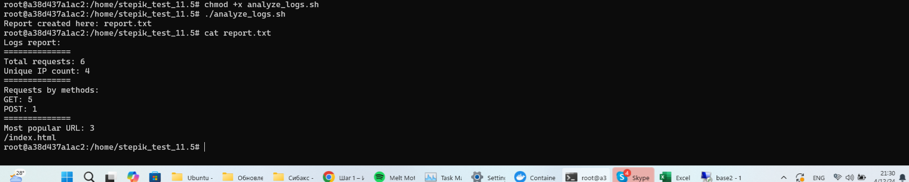

# Итак, это выполнение степа 11.5

Ссылка на задание:

https://stepik.org/lesson/1391036/step/1?unit=1407755

## Описание репозитория
* Файл access.log

Сгенерированный файл логов, предоставляется в задании.
* Файл analyze_logs.sh

Файл скрипта на bash.

* Файл report.txt

Файл отчёта.

## Запуск скрипта.

Скрипт подсчитывает:
* Общее количество запросов.
* Количество уникальных IP-адресов с использованием awk.
* Количество запросов по методам (GET, POST и т.д.) с использованием awk.
* Находит самый популярный URL с использованием awk.
* Создаёт отчет в виде текстового файла report.txt

